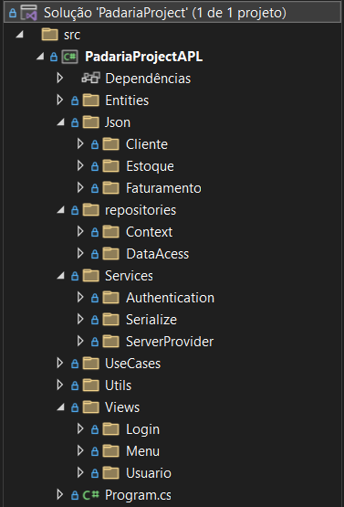
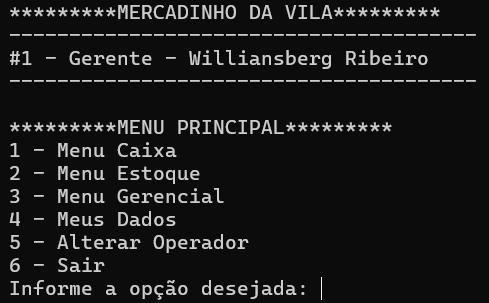
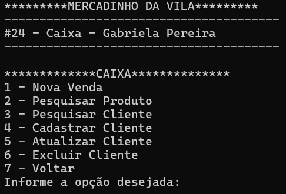
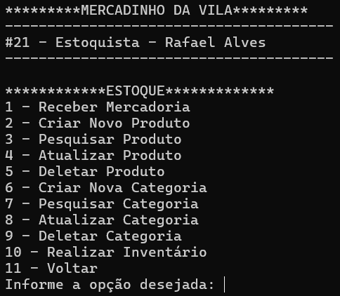
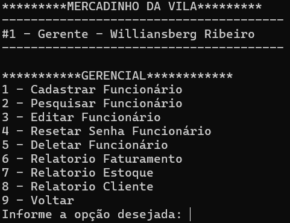

# Sistema gerenciador de Mercado/Padaria

Este é um projeto básico desenvolvido para exercitar conceitos de programação. O projeto consiste num aplicativo de console usado para gerenciar um mercadinho/padaria tendo como algumas funcionalidades login, controle de mercadorias, criação de novos pedidos, gestão de faturamento, clientes, funcionários e estoque. 

Neste projeto foi utilizado as seguintes ferramentas:
 - Linguagem de programação C# com .NET
 - Banco de dados relacional com Oracle Database + Entity Framework Core.
 - Injeção de Dependências.
 - Métodos CRUD (Create, Read, Update, Delete).
 - Metodologia MVC com Entities (Model), Views (View) e Repositories (Controller) .

## Estrutura do Projeto
- **Entities**: Contém as classes que são espelho das entidades do banco de dados.
- **Json**: Armazena dados importantes serializados em formato json.
- **Repositórios**: Contém os métodos e operações, sendo separado por responsábilidades.
- **Services**: Responsável pela injeção de dependência, métodos de autenticação e serialização.
- **View**: Reponsável por toda as exibições do console.
- **Use Case**: Caso de uso principal, que a partir dele desencadeia todas as outros funcionalidades.
- **Util**: Classe de apoio aos repositorios contendo métodos úteis e compartilhados.
  

    
  

## Banco de Dados
A partir da análise de requisitos, foi realizada a modelagem do banco de dados relacional e feito a normalização de suas entidades.

Principais entidades:
  - Cliente
  - Funcionário
  - Estoque
  - Pedido
  - Produto
  - Pagamento
  

    
  

## Injeção de Dependência
No projeto, utilizamos a injeção de dependência para gerenciar as dependências entre os objetos e o banco. Isso é feito através da classe `Services`, que configura os serviços necessários e os disponibiliza para o resto da aplicação.
  

    
  

## Funcionalidades
### Menu Principal
Após efetuar o login com sucesso, o usuário será direcionado ao menu principal, onde ele poderá:
 - Acessar o Caixa (se tiver permissão).
 - Acessar o Estoque (se tiver permissão).
 - Acessar o Menu Gerencial (se tiver permissão).
 - Verificar suas informações e alterar sua senha.
 - Trocar de usuário.
 - Finalizar o programa.

  

### Menu Caixa
Nesse menu o operadorador de caixa poderá realizar funções pertinentes ao seu cargo, podendo ser:
 -  Realizar uma nova venda.
 -  Pesquisar um cliente ou produto.
 -  Cadastrar, atualizar ou excluir (CRUD) um cliente.

  

### Menu Estoque
No menu de estoque, o estoquista poderá manipular os produtos, como:
 - Realizar o recebimento de mercadorias no sistema.
 - Pesquisar, cadastrar, atualizar ou deletar (CRUD) uma categoria. 
 - Pesquisar, cadastrar, atualizar ou deletar (CRUD) um produto.
 - Realizar o inventário/contagem dos produtos.
 

  

### Menu Gerencial
Esse é o menu responsável por gerir a loja:
 - O responsável poderá Pesquisar, cadastrar, atualizar ou excluir (CRUD) um funcionário.
 - Verificar relatórios de faturamento.
 - Verificar relatórios de clientes.
 - Verificar relatórios de estoque.

  

 

#
Este projeto foi desenvolvido como exercício para práticas em programação e manipulação de dados. Qualquer dúvida ou sugestão, sinta-se à vontade para entrar em contato!
